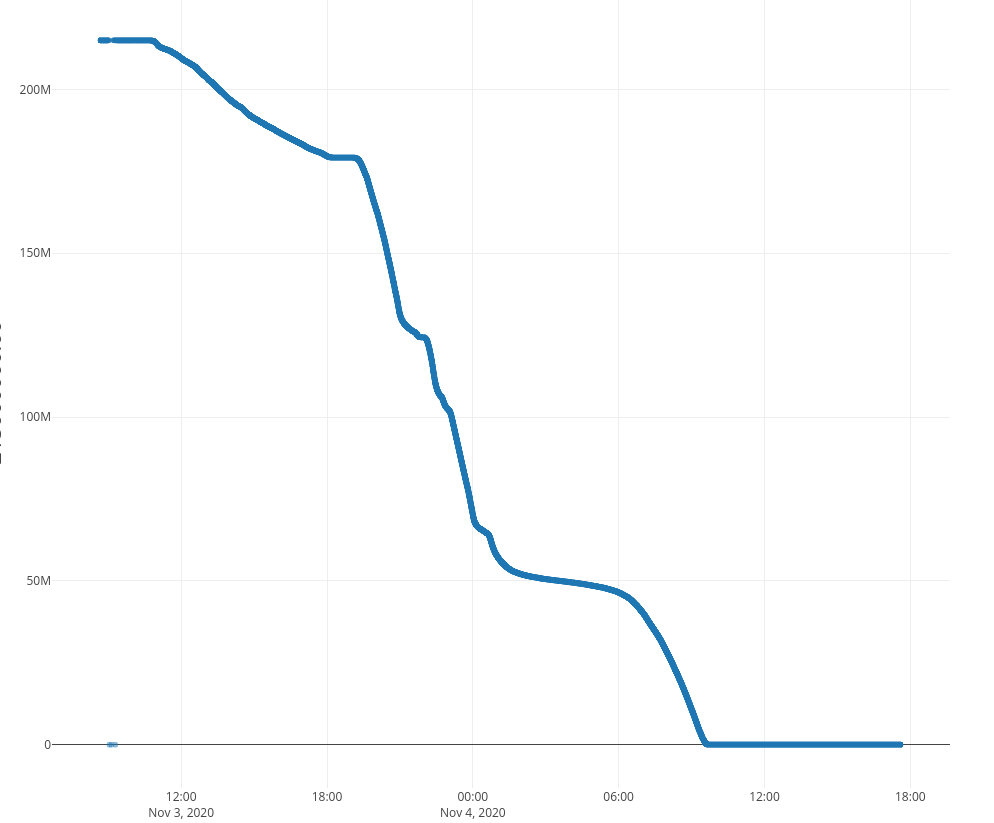

# Valore fondi disponibili Bonus Mobilità

Dati raccolti a partire dal 3 novembre 2020 alle 8 circa mediante questo script:

```bash
while true; do
  printf "%s,%s\n" "$(date +"%s.%N")" "$(curl 'https://www.buonomobilita.it/amount-retriever/api/amount?nocache=$RANDOM')" | tee -a bonus_mobilità.csv
  sleep 2
done
```



## Licenza

Creative Commons CC0 1.0 Universal / Pubblico dominio
